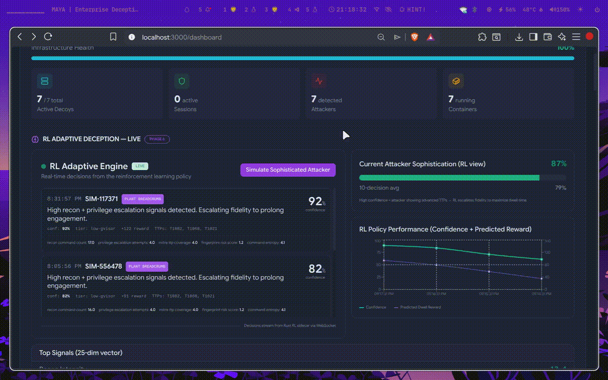
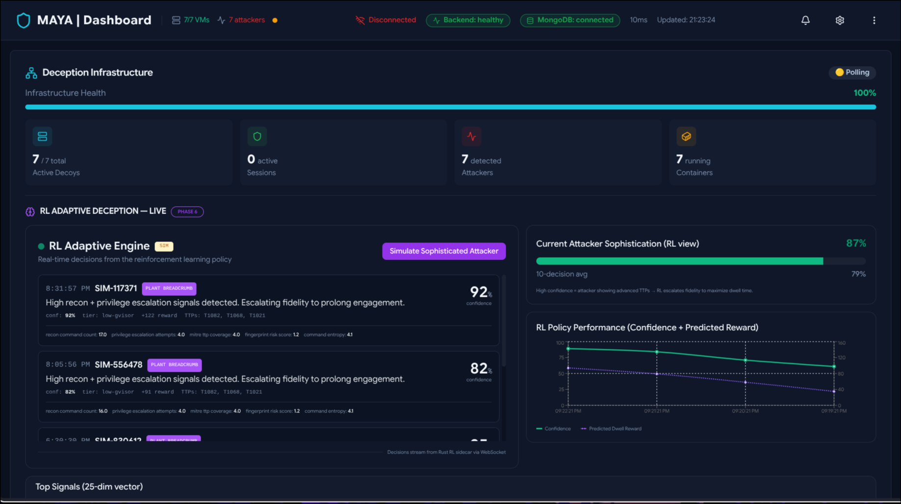
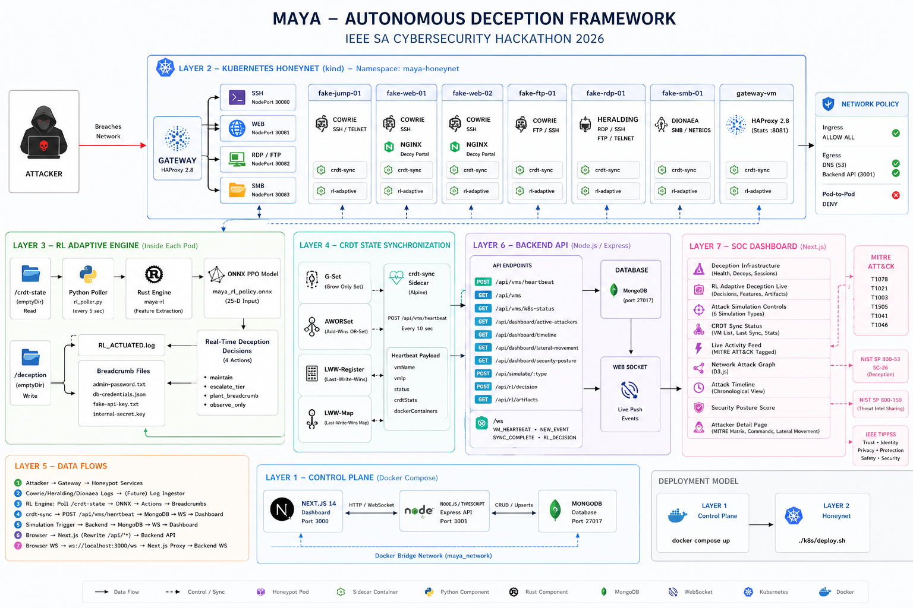
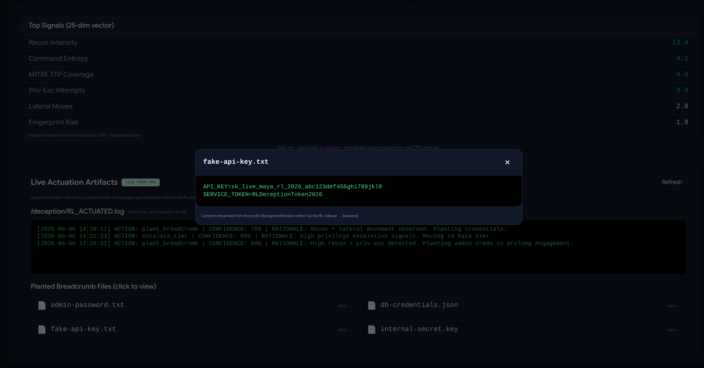
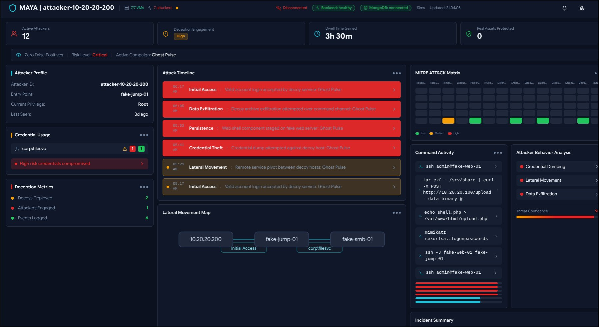

# Maya - Autonomous Deception Fabric

> Trap attackers. Study them. Harden your defenses.


Maya is an enterprise cybersecurity deception platform that deploys autonomous honeypot networks which mirror real infrastructure. When an attacker follows planted breadcrumbs, they enter a parallel fake environment where activity is tracked, fingerprinted, synchronized across nodes, mapped to MITRE ATT&CK, and streamed to a live SOC dashboard.



## What Maya Does

Traditional defenses wait for attackers to hit real systems. Maya uses deception as detection.

- Deploys a parallel fake network with SSH, web, FTP, RDP, and SMB decoys.
- Plants believable fake credentials, files, keys, and internal portals as breadcrumbs.
- Tracks attacker state across distributed nodes with Rust CRDT synchronization.
- Uses an RL adaptive engine to change the environment based on attacker behavior.
- Maps activity to MITRE ATT&CK techniques for structured threat intelligence.
- Streams infrastructure, attacker, CRDT, and RL data to a Next.js dashboard in real time.

The result: defenders are not only detecting attackers, they are studying how attackers move.

## Screenshots

### Dashboard Overview



### Architecture



### Live Actuation Artifacts



### Attacker Profile



## Architecture

Maya runs as a two-layer stack:

```text
Layer 1 - Control Plane : docker compose up
Layer 2 - Honeynet      : ./k8s/deploy.sh
```

```text
                     Internet
                         |
                    [ Attacker ]
                         |
                  [ gateway-vm ]
                   HAProxy 2.8
                         |
        +----------------+----------------+
        |                |                |
   fake-jump-01     fake-web-01      fake-ftp-01
   Cowrie SSH       Cowrie+nginx     Cowrie FTP
        |                |                |
   fake-rdp-01     fake-web-02      fake-smb-01
   Heralding       Cowrie+nginx     Dionaea-style SMB
        |
   [ crdt-sync sidecar ] -> POST /api/vms/heartbeat
   [ rl-adaptive sidecar ] -> ONNX PPO decisions
        |
   [ Backend API - Node.js + TypeScript ]
        |
   [ MongoDB ] + [ WebSocket ]
        |
   [ SOC Dashboard - Next.js ]
```

## Core Components

| Component | Tech | Purpose |
| --- | --- | --- |
| Backend API | Node.js, TypeScript, Express, MongoDB | Aggregates attacker data, VM status, RL decisions, MITRE mappings, and WebSocket events |
| Frontend Dashboard | Next.js, React, Tailwind CSS, shadcn/ui, Recharts | Real-time SOC dashboard, attacker profiles, infrastructure health, MITRE heatmap, RL panels |
| Kubernetes Honeynet | kind, Kubernetes, HAProxy, Cowrie, nginx | Attacker-facing decoy network with isolated honeypot pods |
| CRDT Sync | Rust, shell sidecars, heartbeat API | Distributed attacker state synchronization without a central coordinator |
| RL Adaptive Engine | Python training, ONNX export, Rust inference | Chooses maintain, escalate, breadcrumb, or observe actions |
| Simulation Layer | Vagrant, libvirt, QEMU/KVM | Optional VM-based fake and real infrastructure simulations |

## Quick Start

No Vagrant, KVM, Kubernetes, or Rust required for the basic dashboard demo.

```bash
git clone https://github.com/karandesai2005/Maya_Deception_Tech
cd Maya_Deception_Tech
cp .env.example .env
docker compose up --build
```

Open the dashboard:

```text
http://localhost:3000
```

The control plane starts:

- MongoDB on `localhost:27017`
- Backend API on `localhost:3001`
- Frontend dashboard on `localhost:3000`

The dashboard can run with simulated attacker data automatically. To connect real honeypot VMs, see [simulations/README.md](simulations/README.md).

## Kubernetes Honeynet

The Kubernetes layer deploys seven attacker-facing decoy pods in a `maya-honeynet` namespace using kind.

| Pod | Image | Simulates |
| --- | --- | --- |
| `gateway-vm` | `haproxy:2.8-alpine` | Gateway, routing, HAProxy stats breadcrumb |
| `fake-jump-01` | `cowrie/cowrie` | SSH jump server |
| `fake-web-01` | `cowrie/cowrie` + `nginx:alpine` | Web server and SSH surface |
| `fake-web-02` | `cowrie/cowrie` + `nginx:alpine` | Secondary web server |
| `fake-ftp-01` | `cowrie/cowrie` | FTP and SSH service |
| `fake-rdp-01` | Cowrie-based demo service | RDP-facing decoy service |
| `fake-smb-01` | Cowrie-based demo service | SMB-facing decoy service |

### Deploy

Prerequisites: Docker, kind, and kubectl.

```bash
# Start the control plane first.
docker compose up -d

# Start the honeynet.
chmod +x k8s/deploy.sh
./k8s/deploy.sh
```

Useful endpoints after deployment:

```text
Dashboard:       http://localhost:3000
Backend API:     http://localhost:3001
Gateway:         http://localhost:8080
HAProxy stats:   http://localhost:8081/stats
```

Watch CRDT heartbeats:

```bash
kubectl logs -n maya-honeynet deployment/fake-jump-01 -c crdt-sync -f
```

Tear down:

```bash
./k8s/teardown.sh
```

## RL Adaptive Engine

Maya includes an offline RL training pipeline and a Rust inference sidecar path. The policy observes attacker behavior, turns it into a 25-dimensional feature vector, and chooses one of four deception actions.

```text
/crdt-state
    |
Python poller / Rust feature extractor
    |
25-dimensional attacker behavior vector
    |
ONNX PPO model: maya_rl_policy.onnx
    |
Action:
  0 maintain
  1 escalate_tier
  2 plant_breadcrumb
  3 observe_only
    |
/deception volume:
  admin-password.txt
  db-credentials.json
  fake-api-key.txt
  internal-secret.key
```

Train and export the model:

```bash
cd rl-training
python -m venv .venv
source .venv/bin/activate
pip install -r requirements.txt
python data_generator.py --num-episodes 800 --out data/synthetic/
python train_ppo.py --total-timesteps 80000 --log-dir logs/ppo_maya
python export_onnx.py \
  --model-path logs/ppo_maya/best/best_model.zip \
  --out models/maya_rl_policy.onnx
python test_roundtrip_onnx.py --model models/maya_rl_policy.onnx
```

Run the Rust side:

```bash
cd scripts/rl
cargo run -- simulate
```

## CRDT State Synchronization

The difficult part of a distributed honeypot is keeping attacker state consistent across nodes without trusting a central coordinator. Maya uses Conflict-free Replicated Data Types so nodes can converge even with network partitions or out-of-order messages.

| CRDT Type | Data | Merge Rule |
| --- | --- | --- |
| G-Set | Visited hosts and historical actions | Union; hosts are never unvisited |
| AWOR-Set | Stolen credentials | Add-wins; credential theft is permanent |
| LWW-Register | Current attacker location | Last write wins by Lamport timestamp |
| LWW-Map | Active sessions per host | Per-key last-write-wins resolution |

CRDT activity is surfaced through VM heartbeats and dashboard panels such as CRDT sync status, infrastructure overview, and live activity feeds.

## MITRE ATT&CK Mapping

Maya classifies attacker actions into ATT&CK tactics and techniques.

| Attacker Action | Technique | Tactic |
| --- | --- | --- |
| SSH login with fake credential | T1078 - Valid Accounts | Initial Access |
| Pivot between honeypot nodes | T1021 - Remote Services | Lateral Movement |
| Credential dumping attempt | T1003 - OS Credential Dumping | Credential Access |
| Web shell deployment | T1505 - Server Software Component | Persistence |
| Data exfiltration attempt | T1041 - Exfiltration Over C2 | Exfiltration |
| Network/service scan | T1046 - Network Service Discovery | Discovery |

MITRE data can be synced locally using the backend job in [backend/jobs](backend/jobs).

## Dashboard Features

- Infrastructure overview with VM/pod health and live status.
- Attacker profiles with IP, entry point, dwell time, privilege level, and campaign signals.
- Attack timeline with severity and command activity.
- MITRE ATT&CK matrix and technique coverage.
- Lateral movement graph showing attacker pivots.
- Credential usage and decoy artifact tracking.
- RL decision, reward, feature, and sophistication panels.
- WebSocket-driven live activity feed.

## Repository Layout

```text
backend/          Node.js API, MongoDB models, WebSocket services
frontend/         Next.js dashboard and API routes
k8s/              kind-based Kubernetes honeynet manifests
scripts/crdt/     Rust CRDT implementation and helper binary
scripts/rl/       Rust RL inference and sidecar support
rl-training/      Python PPO training and ONNX export pipeline
simulations/      Vagrant/libvirt real, fake, and control-plane simulations
docs/             Architecture docs, screenshots, GIF, and research paper
```

## Documentation

- [Architecture](docs/architecture.md)
- [Simulations](docs/simulations.md)
- [Testing](docs/testing.md)
- [Research Paper](docs/research-paper.pdf)
- [Backend](backend/README.md)
- [RL Training](rl-training/README.md)
- [Simulation Infrastructure](simulations/README.md)

## Environment Variables

```env
PORT=3001
MONGODB_URI=mongodb://localhost:27017/maya_deception
JWT_SECRET=dev-secret-change-in-production
NODE_ENV=development
SIMULATION_MODE=true
CRDT_SYNC_INTERVAL=10000
CORS_ORIGINS=http://localhost:3000
NEXT_PUBLIC_API_URL=http://backend:3001
```

## Standards Alignment

| Standard | Coverage |
| --- | --- |
| MITRE ATT&CK | T1078, T1021, T1003, T1505, T1041, T1046 |
| NIST SP 800-53 | SC-26 deception concepts |
| NIST SP 800-150 | Threat intelligence sharing concepts |
| IEEE TIPPSS | Trust, Identity, Privacy, Protection, Safety, Security |

## Research Value

- CRDT theory applied to distributed deception state.
- RL-driven deception that adapts to attacker sophistication.
- Deception as detection, where interaction with planted assets is a high-signal event.
- MITRE ATT&CK integration for structured threat intelligence.
- Lateral movement simulation for red-team and purple-team exercises.
- Real-time SOC tooling for operational visibility.

## Known Limitations

- The default local stack is configured for research and demo use.
- API and WebSocket authentication are not production hardened yet.
- Some Kubernetes honeypot services use demo-compatible containers while preserving the service-facing simulation.

## Roadmap

- JWT-based API and WebSocket access control.
- MISP integration with STIX/TAXII export.
- Windows Active Directory decoys.
- Automated blocking or containment workflows for confirmed attackers.
- Deeper RL sidecar rollout across all honeypot pods.

## Authors

Built by [Karan Desai](https://github.com/karandesai2005), [Pankhuri Varshney](https://github.com/pankhuriVarshney), and [Reeti Agarwal](https://github.com/Reeti05Agarwal).

> The best way to understand how attackers think is to watch them work without letting them know they are being watched.
